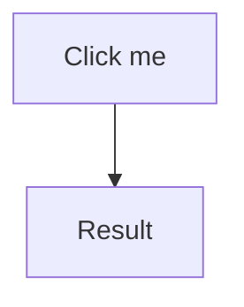
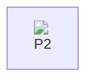
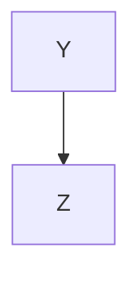
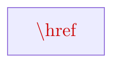
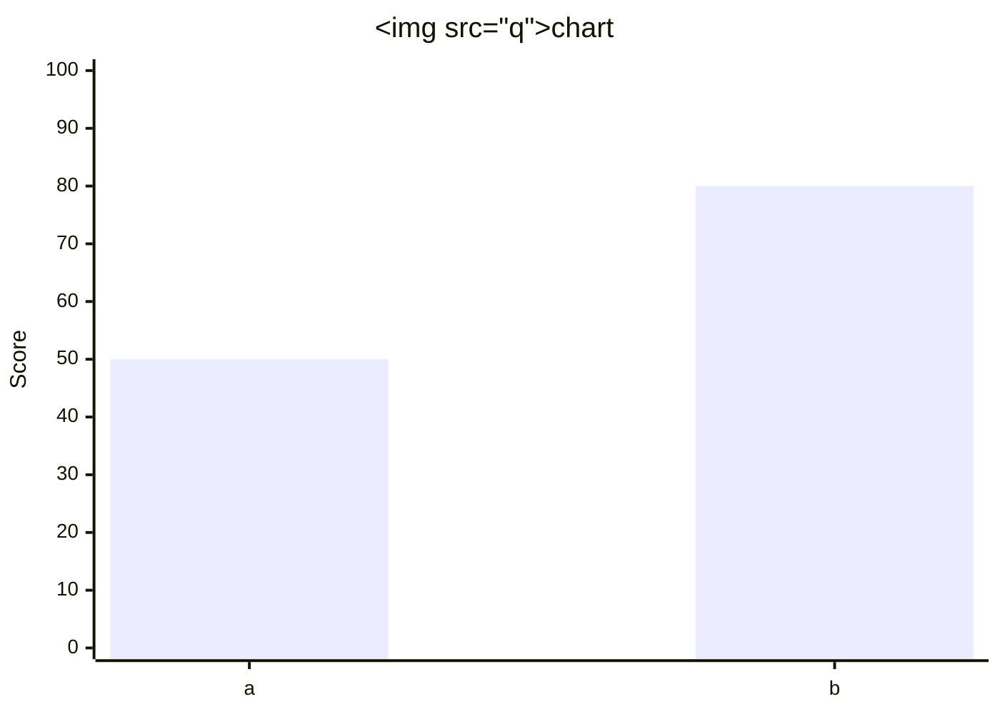
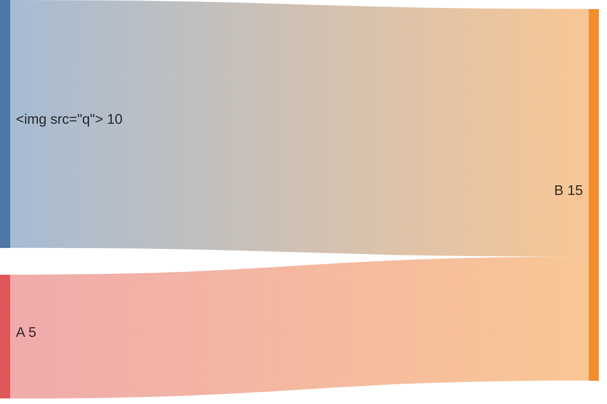
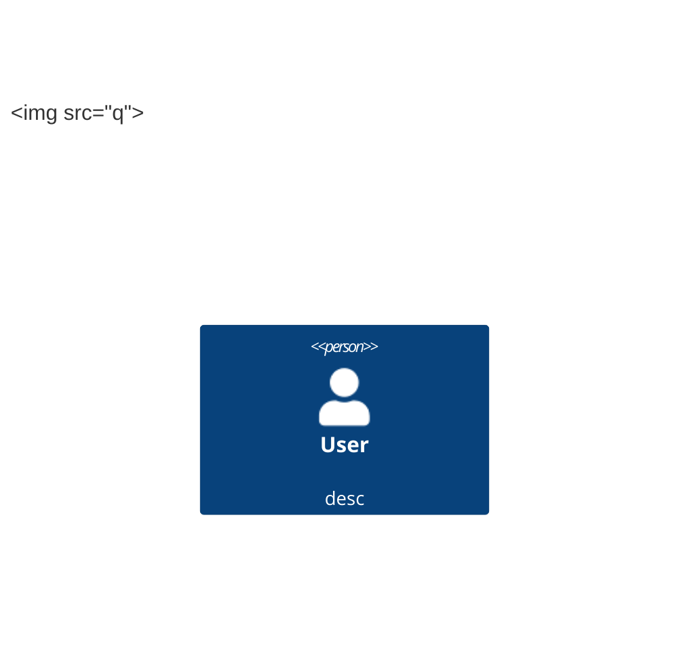
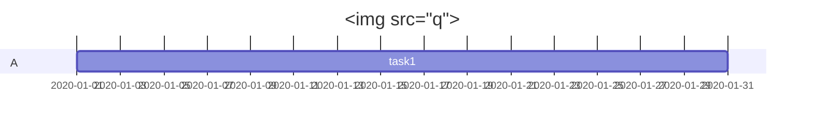
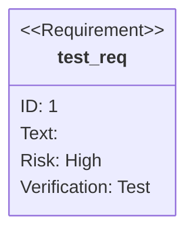

# Mermaid XSS Probes

## P1: click directive javascript scheme


## P2: HTML in node label (htmlLabels)


## P3: securityLevel loose directive


## P4: KaTeX-in-mermaid trust


## P5: xychart-beta newer diagram type


## P6: sankey-beta


## P7: c4 architecture


## P8: linkStyle / style with url
```mermaid
flowchart LR
    A --> B
    style A fill:url('javascript:document.body.dataset.xssP8=1'),color:red
```

## P9: gantt


## P10: requirementDiagram

